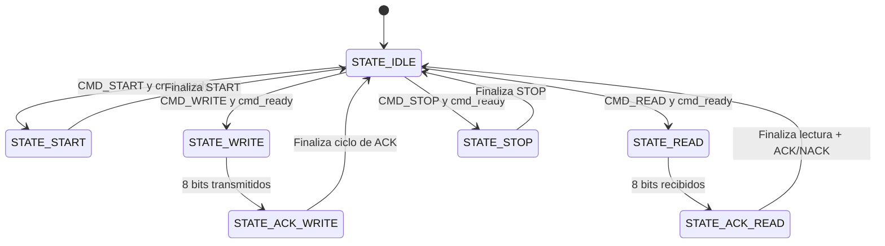

# Protocolo I2C en Verilog (Maestro y Esclavo EEPROM)

Este repositorio contiene una implementación robusta del protocolo **I2C (Inter-Integrated Circuit)** en Verilog-2001, que incluye un controlador **Maestro (I2C Master)** basado en comandos y un **Esclavo (I2C Slave)** que emula una memoria EEPROM 24C02 de 256 bytes. 

El diseño soporta características clave del protocolo I2C estándar, tales como condiciones de **Repeated START** para lecturas aleatorias eficientes, **Clock Stretching** (estiramiento de reloj por parte del esclavo) y direccionamiento de 7 bits.

---

## Estructura del Proyecto

El repositorio está organizado de la siguiente manera:

```text
├── src/
│   ├── i2c_master.v   # Controlador Maestro I2C estructurado por comandos
│   └── i2c_slave.v    # Modelo de Esclavo EEPROM 24C02 (256 bytes)
├── tb/
│   └── tb_i2c.v       # Banco de pruebas (Testbench) autocontenido
└── sim/
    ├── sim.log        # Log de salida de la última simulación
    └── i2c_simulation.vcd  # Formato de ondas VCD para análisis
```

---

## Características de la Implementación

### 1. Controlador Maestro (`i2c_master.v`)
*   **FSM Basada en Comandos**: Se controla de forma externa mediante comandos de nivel superior (`CMD_START`, `CMD_WRITE`, `CMD_READ`, `CMD_STOP`).
*   **Repeated START**: Permite realizar transiciones limpias entre ciclos de escritura y lectura sin liberar el bus (fundamental para lecturas aleatorias).
*   **Divisor de Reloj Interno**: Genera la frecuencia de reloj `SCL` en 4 fases (`F0`, `F1`, `F2`, `F3`) para garantizar tiempos de setup y hold correctos tanto para SDA como para SCL.
*   **Control del Bus Activo (`bus_active`)**: Mantiene la línea `SCL` en bajo durante los estados inactivos de la máquina de estados cuando una transacción continúa activa, previniendo STOPs y STARTs espurios.

### 2. Modelo de Esclavo EEPROM (`i2c_slave.v`)
*   **Memoria Interna**: Matriz de almacenamiento de 256 bytes con direccionamiento de 8 bits.
*   **Operación de Lectura Aleatoria (Random Read)**: Implementa la secuencia completa (Escritura de dirección de registro -> Repeated START -> Lectura del dato).
*   **Escritura Secuencial**: Soporta auto-incremento interno del puntero de dirección (`reg_addr`).
*   **Sincronización Avanzada**: Filtros de sincronización en `SDA` y `SCL` para mitigar problemas de metaestabilidad en sistemas sincrónicos.

---

## Diagrama de la Máquina de Estados del Maestro



---

## Simulación y Verificación

El proyecto ha sido completamente verificado usando **Icarus Verilog** y **GTKWave**.


### Ejecutar Simulación

Para compilar y ejecutar el banco de pruebas, ejecuta el siguiente comando en la raíz del proyecto:

```bash
# Crear directorio de simulación si no existe
mkdir -p sim

# Compilar y simular
iverilog -o sim/i2c_sim src/i2c_master.v src/i2c_slave.v tb/tb_i2c.v
vvp sim/i2c_sim
```

### Flujo de Prueba Verificado en `tb_i2c.v`

El banco de pruebas ejecuta de manera autónoma las siguientes operaciones para validar la comunicación I2C:
1.  **Operación de Escritura**: Escribe el dato `8'hA5` en la dirección de registro `8'h20` de la EEPROM.
2.  **Operación de Lectura Aleatoria (Random Read)**:
    *   Envía un comando de escritura con la dirección del registro (`8'h20`).
    *   Genera una condición de **Repeated START** (sin liberar el bus).
    *   Envía la dirección del esclavo en modo lectura (`rnw = 1`).
    *   Lee el dato devuelto por la EEPROM y valida que coincida exactamente con `8'hA5`.
3.  **Comparación**: Se valida automáticamente que el dato leído sea igual al escrito.

Al finalizar la simulación, verás la siguiente salida en tu consola o en el archivo `sim/sim.log`:
```text
=== Resultados de Verificación ===
[SUCCESFUL] TEST PASSED: El dato leido (8'ha5) coincide con el dato escrito (8'hA5).
```

### Visualización de Ondas (VCD)

Puedes abrir el archivo de ondas generado con GTKWave para analizar los flancos detallados de las señales SDA, SCL y los estados internos:
```bash
gtkwave sim/i2c_simulation.vcd
```

---

## Señales de la Interfaz del Maestro

| Puerto | Dirección | Ancho | Descripción |
| :--- | :---: | :---: | :--- |
| `clk` | Entrada | 1 | Reloj principal del sistema |
| `rst_n` | Entrada | 1 | Reset global activo en bajo |
| `addr` | Entrada | 7 | Dirección del dispositivo esclavo (7 bits) |
| `rnw` | Entrada | 1 | Bit de lectura/escritura (Read = 1, Write = 0) |
| `wdata` | Entrada | 8 | Byte de datos a escribir |
| `cmd` | Entrada | 2 | Comando (`2'b00`: START, `2'b01`: WRITE, `2'b10`: READ, `2'b11`: STOP) |
| `cmd_valid` | Entrada | 1 | Indica que la entrada del comando es válida |
| `last_byte` | Entrada | 1 | Indica si es el último byte en lectura (para mandar NACK) |
| `rdata` | Salida | 8 | Byte de datos leído |
| `cmd_ready` | Salida | 1 | El maestro está listo para aceptar un nuevo comando |
| `ack_err` | Salida | 1 | Bandera de error si se recibe un NACK del esclavo |
| `busy` | Salida | 1 | El controlador está ocupado con una transacción activa |
| `sda` | Bidireccional | 1 | Línea de datos serie I2C (Open-drain) |
| `scl` | Bidireccional | 1 | Línea de reloj serie I2C (Open-drain) |
